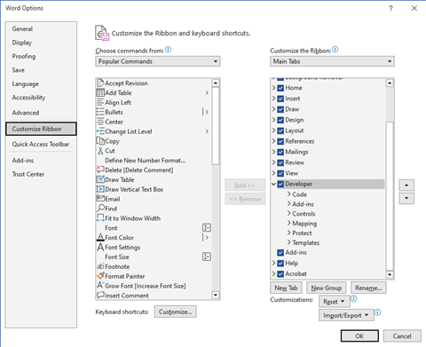

# Editing a Microsoft Word Template

## Setup: Enable the Developer Tab

To edit a Microsoft Word Template, you will need the Developer Tab in the ribbon. This is only available on the desktop version of Microsoft Word. If this is already enabled, you will see the Developer Tab as shown below and can move onto [Adding/Editing Content Controls](#addingediting-content-controls):

If it does not appear, go to Word Options in one of two ways:
1. Right click on the ribbon and click on "Customize Ribbon" or...
2. Click on File at the top left, and then go to Options at the bottom on the left. If you do not see options, you need to click on "More..." first.

Next, check the Developer box in the right column and click "OK". You may have to scroll down to find it.

[Back to top](#top)

## Adding/Editing Content Controls

Word Template Content Controls include the following properties:

* `Title`: text used to describe the content control it belongs to
* `Tag`: a unique identifier for the content control it belongs to
* Default Value: the value to be populated in the template if no value is provided. 
* Plain Text Properties - Allow carriage returns (multiple paragraphs): allows newline characters to be entered in the content control

### 